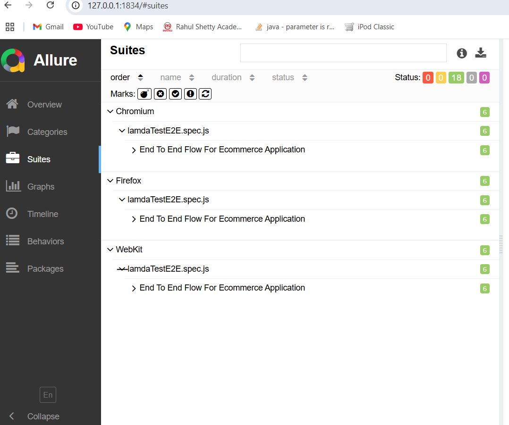
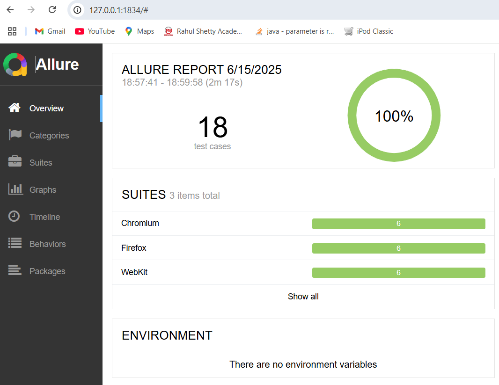
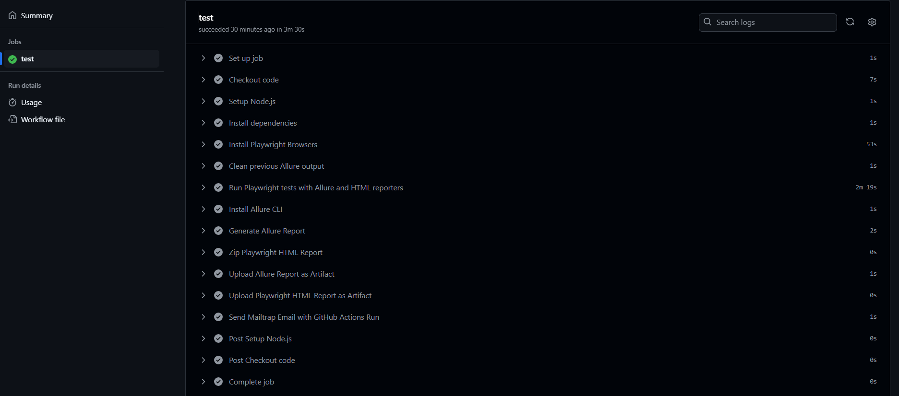
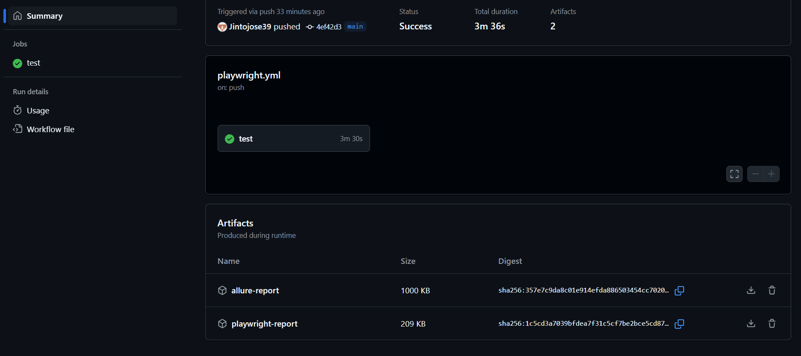
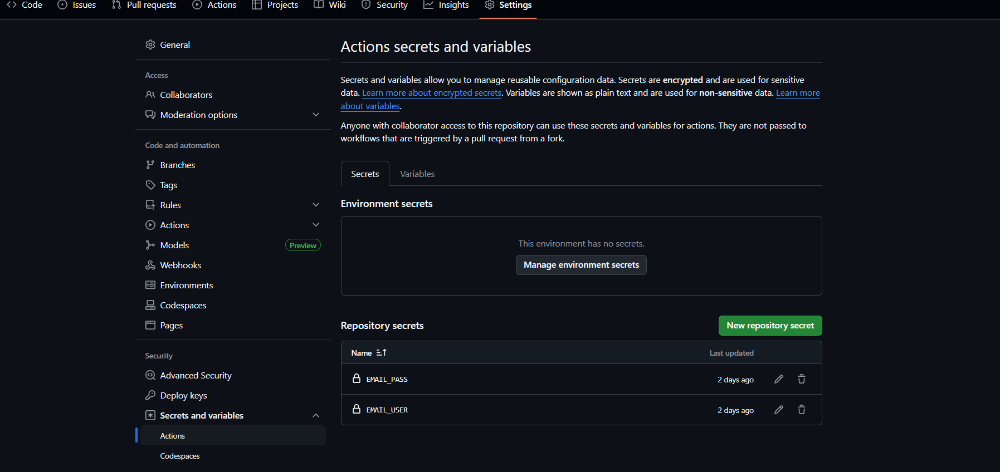
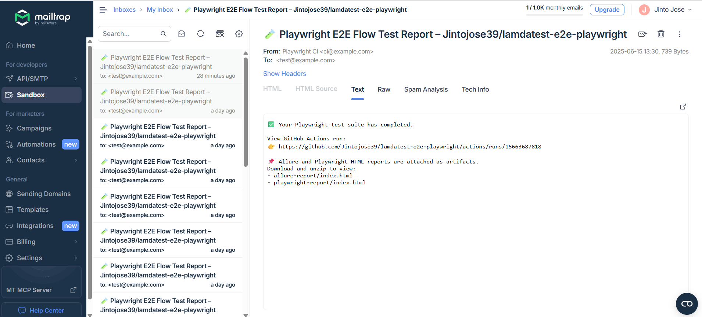

# 💼 E-Commerce Application E2E Testing using Playwright

This project demonstrates a complete end-to-end (E2E) testing flow for an e-commerce application using Playwright Test Runner. It follows best practices with the Page Object Model (POM), JSON-based test data, CI with GitHub Actions, Allure and HTML reporting, and test summary email notifications via Mailtrap.

---

## 📂 Folder Structure

```
.
├── .github/workflows/         # CI workflow (GitHub Actions)
├── allure-report/             # Allure HTML output (generated)
├── allure-results/            # Allure raw result files
├── pages/                     # Page Object classes
├── report-screenshots/        # Screenshots for report preview and CI steps
├── testData.json/             # JSON files for env, flow data, login credentials
├── tests-examples/            # Sample test structure (optional)
├── tests/                     # Main test spec files
├── utils/                     # POManager and reusable utilities
├── playwright.config.js       # Playwright configuration
├── package.json               # Project metadata and dependencies
├── README.md
```

---

## ✅ Test Scenarios Covered

* User registration with dynamically generated data (handled in beforeEach hook)
* Homepage product dropdown validation
* Product search and add to cart
* Checkout process validation
* Billing address form filling
* Order confirmation
* Order ID and date verification in order history
* Logout from the account

> All tests are written inside `lamdaTestE2E.spec.js` and use data from `lamdaE2Eflow.json`, `loginCredentials.json`, and `env.json`.

---

## 🔄 GitHub Actions CI Workflow

CI is triggered on every push or pull request to `main`/`master` branches.

### Workflow Steps:

* ✅ Setup job
* ✅ Checkout code
* ✅ Setup Node.js & Playwright Browsers
* ✅ Install dependencies
* ✅ Clean previous Allure results
* ✅ Run Playwright tests with Allure & HTML reporters
* ✅ Install Allure CLI
* ✅ Generate Allure Report
* ✅ Zip Playwright HTML Report
* ✅ Upload both reports as GitHub artifacts
* ✅ Send Mailtrap email with report summary

> Average Run Time: \~3 minutes

---

## 📊 Test Reporting

### ✅ Allure Report

* Provides detailed insights with labels, timelines, features
* Annotations added in test code for better tracking
* Generated by CLI:

```bash
npx allure generate allure-results --clean -o allure-report
npx allure open allure-report
```

### ✅ Playwright HTML Report

* Auto-generated via Playwright
* Can be opened locally:

```bash
npx playwright show-report
```

### Access Reports in CI:

* Download artifacts from GitHub Actions run summary

---

## 📸 Screenshots from Workflow and Reporting

### 🧪 Allure Report Preview





### 🧪 PlayWright Report Preview


### 🚀 GitHub Actions Run





### 📧 Mailtrap Summary Email



---

## 📧 Mailtrap Email Integration

* Uses Mailtrap SMTP to send test summary emails
* Configured in GitHub Actions workflow
* Sends test result, timestamp, and artifact links to QA/devs

---

## 🚀 Quick Start

### 1. Clone and install dependencies

```bash
git clone https://github.com/Jintojose39/lamdatest-e2e-playwright.git
cd lamdatest-e2e-playwright
npm install
```

### 2. Run tests locally

```bash
npx playwright test
```

### 3. Generate and open Allure Report

```bash
npx allure generate allure-results --clean -o allure-report
npx allure open allure-report
```

---

## 💡 Tech Stack

* [Playwright](https://playwright.dev/) for browser automation
* Page Object Model for maintainability
* JSON-based test data
* GitHub Actions for CI/CD
* Allure & Playwright HTML reports
* Mailtrap for notification emails

---

## 👤 Author

**Jinto Jose**
[GitHub Profile](https://github.com/Jintojose39)

---

## 📥 Notes

* Ensure `.gitignore` includes:

```
# Playwright
node_modules/
test-results/
playwright-report/
blob-report/
playwright/.cache/
# Allure
allure-results/
allure-report/
```

* Use `npx playwright show-report` or open `allure-report/index.html` in browser after unzip.
* Screenshots stored in `report-screenshots/` are only for documentation and preview purpose on GitHub.

---

Happy Testing! ✨
Contribute or raise issues [here](https://github.com/Jintojose39/lamdatest-e2e-playwright/issues)
